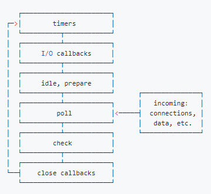

# 基础八股文

## 进程和线程

进程是CPU资源分配的最小单位
线程是CPU资源调度的最小单位

进程和线程之间的关系如下

- 一个进程可以创建多个线程，这些线程共享同一个地址空间和资源，能够并发执行任务
- 线程在进程内部创建和销毁的，他们与进程共享进程的上下文，包括打开的文件，全局变量和堆内存等
- 每个进程至少包含一个主线程，主线程用于执行进程的主要业务逻辑，其它线程可以作物辅助线程来完成特定任务

多进程：在同一个时间里，同一个计算机系统中允许两个或两个以上的进程处于运行状态
多线程：程序包含多个执行流，即在一个程序中可以同时运行多个不同的线程来执行不同的任务，就是说允许单个程序创建多个并行执行的线程来完成各自的任务

- 堆内存
  - js中对象、数组、函数等复杂数据类型都存储在堆内存中
  - 使用new 关键字或对象字面量语法创建对象时，会在堆内存中分配相应的内存空间
  - 堆内存的释放由垃圾回收机制自动处理，当一个对象不在被引用时，垃圾回收机制会自动回收器占用的内存，释放资源
- 栈内存
  - js中的基本数据类型，数字、布尔值、字符串以及函数的局部变量报仇呢在栈内存中
  - 栈内存的分配时静态的，编译器在编译阶段就确定了变量的内存空间大小
  - 当函数被调用时,会在栈内存中创建一个称为栈帧 stack frame 的数据结构,用于存储函数的参数、局部变量、返回地址等信息
  - 当函数执行完毕或从函数中返回时,对应的栈帧会被销毁,栈内存中的数据也随之释放

## 垃圾回收机制

## 浏览器事件循环机制 （event loop）

### js事件循环

首先我们需要知道：js是单线程的语言，EventLoop是js的执行机制

异步队列有两种：macro（宏任务）队列和 micro（微任务）队列。宏任务队列可以有多个，微任务队列只有一个

- 宏任务 (包含整体代码script，setTimeout，setInterval，setImmediate， I/O 操作、UI 渲染)
- 微任务 (Promise，process.nextTick、Object.observe、MutationObserver)

当某个宏任务执行完后，会查看是否有微任务队列，如果有，先执行微任务队列中的所有任务，如果没有，会读取宏任务队列中排在最前面的任务，执行宏任务的过程中没要到微任务，一次加入微任务队列。栈空后，再次读取微任务队列里的任务，依次类推



### node事件循环

外部输入数据 -> 轮循阶段(poll) -> 检查阶段(check) -> 关闭阶段(close callbacks) -> 定时器检查阶段(timer) -> I/O 阶段(I/O callbacks) -> 闲置阶段(idle, prepare) -> 轮询阶段(poll)

- timer阶段： 执行到期的setTimeout/setInterval队列回调
- I/O阶段：执行上轮循环循环中的少数未执行的 I/O 回调
- idle，prepare (仅node内部使用)
- poll
  - 执行回调
  - 执行定时器
    - 如有到期的setTimeout/setInterval，则返回timer阶段
    - 如有setImmediate，则前往check阶段
- check阶段 执行setImmediate
- close callbacks

process.nextTick 独立于EventLoop之外的，它有一个自己的队列，当每个阶段完成后，如果存在nextTick队列，就会清空队列中的所有回调函数，并且优先于其它microtask执行


## 跨域

前端领域中，跨域是指浏览器允许向服务器发送跨域请求，从而克服Ajax只能同源使用的限制

同源策略：协议+域名+端口相同 (即使两个不同的域名指向了同一个ip地址，也非同源)

他会限制以下几种行为

- Cookie, LocalStorage 和 IndexDB无法读取
- DOM和JS 对象无法获得
- AJAX请求无法发送

### 简单请求和非简单请求

简单请求：满足以下两大条件

- 方法是以下3中之一
  - HEAD
  - GET
  - POST
- 头信息不超过以下几个字段
  - Accept
  - Accept-Language
  - Content-Language
  - Last-Event-ID
  - Content-type

凡是不满足以上两个条件的，就属于非简单请求，非简单请求的CORS请求，会在正式通信之前，增加一次HTTP查询请求，称为“预检”请求
浏览器先询问服务器，服务器收到预检请求后，检查Origin、Access-Control-Request-Methods和Access-Control-Request-Headers字段以后，确认允许跨源请求，浏览器才会发出正式的XMLHttpRequest请求，否则就报错

### 解决方案

- JOSNP: 利用script标签不受跨域限制的特点，缺点是只支持get请求，只能接收JSON格式的数据，无法处理其它格式的数据
- CORS: 设置 Access-Control-Allow-Origin: *
  - 即跨域资源共享，它允许浏览器向非同源服务器，发送AJAX请求，这种方式的跨域主要是在后端进行设置
  - 整个CORS通信过程，都是浏览器自动完成，不需要用户参与
- postMessage
  - postmessage是一种html5新增的跨文档通信方式，它可以在两个不同的窗口之间进行安全跨域通信。
  - 原理：在一个窗口中发送消息，另一个窗口监听消息并处理
- nginx反向代理跨域
  - 实现原理：通过nginx配置一个代理服务器(同域不同端口)做中间件，反向代理要跨域的域名
- node中间件
  - 原理：同源策略是浏览器要遵循的标准，而如果是服务器向服务器请求就没有跨域这么一说（原理大致和nginx相同，都是通过启一个代理服务器，实现数据的转发）
- websocket
  - websocket 是一种基于TCP协议的双向通信协议，它提供了一种浏览器和服务器之间实时、低延迟、高效率的全双工通信方式，同时允许跨域通讯
  - 浏览器在发送websocket请求时，会在请求头中携带Origin字段，用于告诉服务器该请求的来源。服务器在收到请求后，会根据Origin字段判断是否允许该请求跨域，如果允许，则在响应头中添加CROS头

#### JSONP实现

```js
function getInfo(data) {
  console.log(data) // jsonp 跨域成功
}

let script = document.createElement('script')
script.src = 'https://example.com/api?callback=getInfo'
document.body.appendChild(script)
```

#### postmessage实现

```js
// 发送消息
var targetWindow = window.parent;
var message = 'hello parent message';
targetWindow.postMessage(message, '*'); // 可以指定域名，这里*表示任意上层parent窗口

// 接收消息
window.addEventListener('message', function(event) {
  var message = event.data;
  console.log('message = ' + message);
})
```

#### nginx反向代理

```nginx
server {
    listen 80;
    server_name www.doman1.com;
    location / {
        proxy_pass   http://www.domain2.com:8080;  # 反向代理
        proxy_cookie_domain www.domain2.com www.domain1.com; # 修改cookie里域名
        index  index.html index.htm;

        # 当用webpack-dev-server等中间件代理接口访问nignx时，此时无浏览器参与，故没有同源限制，下面的跨域配置可不启用
        add_header Access-Control-Allow-Origin http://www.domain1.com;  # 当前端只跨域不带cookie时，可为*
        add_header Access-Control-Allow-Credentials true;
    }
}
```

```js
// 前端代码
var xhr = new XMLHttpRequest()
// 前端开关：浏览器是否读写cookie
xhr.withCredentials = true
// 访问nginx中的代理服务器
xhr.open('get', 'http://www.domain1.com:81/?user=admin', true)
xhr.send()
```

```js
// 后端代码
var http = require('http')
var server = http.createServer()
var qs = require('querystring')
server.on('request', function (req, res) {
  var params = qs.parse(req.url.substring(2))
  // 向前台写cookie
  res.writeHead(200, {
    'Set-Cookie': 'l=123456;Path=/;Domain=www.domain2.com;HttpOnly', // HttpOnly:脚本无法读取
  })
  res.write(JSON.stringify(params))
  res.end()
})
server.listen(8080)
```

#### node中间件实现

```js
// nodeMiddleServer
const express = require('express')
const { createproxyMiddleware } = require('http-proxy-middleware')

const app = express()

app.use(express.static(__dirname))
// 使用代理
app.use(
  '/api',
 createproxyMiddleware({
  target: 'http:localhost:8002',
  pathRewrite: {
   "^/api": '',
  },
  changeOrigin: true,
 })
)

app.listen(8001);
```

```js
// nodeServer.js
const express = require('express')
const app = express()

app.get('/request', (req, res) => {
  res.end('request success')
})

app.listen(8002)
```

## 安全（CSRF、XSS）

### XSS(Cross-Site Scripting) 跨站脚本攻击

XSS 是一种代码注入攻击。攻击者可以在目标网站注入恶意脚本，使之在用户浏览器运行。利用这些恶意脚本，攻击者可以获取用户的敏感信息，如Cookie等

- 反射型攻击
  - 攻击者构造出特殊的URL，其中包含恶意代码
  - 用户打开带有恶意代码的url时，网站服务端将恶意代码从URL中取出，拼接在HTML中返回给浏览器
  - 用户浏览器接收到响应后解析执行，混在其中的恶意代码也被执行
  - 恶意代码窃取用户数据并发送到攻击者的网站，或者冒充用户的行为，调用目标网站接口执行攻击者指定的操作
- 存储型攻击
  - 攻击者将恶意代码提交到目标网站数据库中
  - 用户打开目标网站，网站服务端将恶意代码从数据库取出，拼接在HTML中返回给浏览器
  - 用户浏览器接收到响应后解析执行，混在其中的恶意代码也被执行
  - 恶意代码窃取用户数据并发送至攻击者网站或服务器
- 基于dom的xss攻击
  - 攻击者构造出特殊的 URL，其中包含恶意代码
  - 用户打开带有恶意代码的 URL。
  - 户浏览器接收到响应后解析执行，前端 JavaScript 取出 URL 中的恶意代码并执行

xss防范措施

- 输入过滤
- 预防存储型和反射型xss攻击
  - 改成纯前端渲染，把代码和数据分隔开
  - 对HTML做充分转义
- 预防dom的xss攻击
- Content Security Policy
  - 严格的CSP在XSS的防范可以起到下面几个作用
  - 禁止加载外域代码，防止复杂的攻击逻辑
  - 禁止外域提交，网站被攻击后，用户的数据不会泄露到外域
  - 禁止内联脚本执行
  - 禁止未授权的脚本执行
  - 合理使用上报可以及时发现XSS，利于尽快修复问题
- HTTP-only Cookie
  - 禁止js读取某些敏感cookie，攻击者完成XSS注入后也无法窃取此Cookie

### CSRF(Cross-Site request forgery) 跨站请求伪造

攻击者诱导受害者进入第三方网站，在第三方网站中，向被攻击网站发送跨站请求。利用受害者在被攻击网站已经获取的注册凭证，绕过后台的用户验证，达到冒充用户对被攻击网站执行某项操作的目的

- get类型的csrf
  - get类型的csrf非常简单，只需要一个http请求
- post类型的csrf
  - 这种类型的csrf利用起来通常私用的是一个自动提交的表单
- 链接类型的csrf
  - 链接类型的CSRF并不常见，比起其他两种用户打开页面就中招的情况，这种需要用户点击链接才会触发。这种类型通常是在论坛中发布的图片中嵌入恶意链接，或者以广告的形式诱导用户中招，攻击者通常会以比较夸张的词语诱骗用户点击

csrf防范措施

- 同源检测
  - 利用http请求中的 Origin Header 和 Referer Header，服务器可以通过解析这两个header中的域名，来确认请求的来源域
- CSRF token
  - 服务器给用户生成一个Token，这个Token通过加密算法进行过加密
  - 客户端页面提交请求时，把token加入到请求数据或者头信息中，一起传给后端
  - 后端验证前端传来的token和session是否一致
- 给Cookie设置合适的 SameSite

### 其它

- 点击劫持
- HTTP严格传输安全
- CDN劫持
- 内容安全策略

## 缓存策略

浏览器在加载资源时，会先根据这个资源的header判断它是否命中缓存，强缓存如果命中，浏览器直接在自己的缓存中读取资源，不会发请求到服务器
当强缓存没有命中的时候，浏览器一定会发送一个请求到服务器，通过服务器端依据资源的另外一些header字段验证是否命中协商缓存，如果协商缓存命中，服务器会将这个请求返回，但是不会返回这个请求的资源数据，而是告诉客户端可以直接从缓存中加载这个资源
强缓存和协商缓存的共同点是：如果命中，都是从客户端缓存中加载资源，而不是从服务器加载资源数据；区别是：强缓存不发请求到服务器，协商缓存会发请求到服务器
当协商缓存也没命中时，浏览器直接从服务器拉取资源

### 强缓存

当浏览器对某个资源的请求命中了强缓存时，返回的HTTP状态码为200，在谷歌浏览器的开发者工具的network里面size会显示disk cache或memory cache

- Cache-Control 的max-age的优先级高于Expires，以秒为单位，是一个相对时间
  - 第一次请求某个资源，服务器返回这个资源同时，在response的header加上了Cache-control的header，浏览器接收到这个资源后，会把这个资源连同header缓存下
  - 浏览器再次请求这个资源，先从缓存中寻找，找到这个资源后，根据它第一次的请求时间和Cache-control设定的有效期，计算出一个资源过期时间，再拿这个过期时间和当前请求时间比较，如果请求时间再过期时间之前，就命中缓存
- Expires 是http1.0提出的一个表示资源过期时间的header，值是一个绝对时间，由服务器返回
  - 缺点：由于它是服务器返回的一个绝对时间，在服务器时间和客户端时间相差较大时，缓存会出问题，还有就是客户端可以随意更改时间

### 协商缓存

- Last-Modified Last-Modified(服务端响应携带) & If-Modified-Since (客户端请求携带) ，其优先级低于Etag
  - 浏览器第一次跟服务器请求一个资源，服务器返回资源的同时，会在response的header加上Last-Modified，表示资源在服务器上的最后修改时间
  - 浏览器再次请求这个资源，在request header上加上 If-Modified-Since的header，这个header就是上一次请求时返回的Last-Modified
  - 服务器再次受到请求，根据浏览器传过来的If-Modified-Since和资源在服务器上的最后修改时间判断资源是否有变化，如果没有变化则返回304 Not Modified
  - 缺点：有时候服务器上资源有变化，但是最后修改时间却没有变化，就会影响缓存安全性
- ETag Etag(服务端响应携带) & If-None-Match(客户端请求携带)
  - 这个唯一标识是一个字符串，只要资源有变化这个串就不同

服务端判断值是否一致，如果一致，则直接返回304通知浏览器使用本地缓存，如果不一致则返回新的资源


## for...in 和 for...of 和 foreach 区别

for...in 遍历对象属性，顺序不确定，取决于js引擎实现（无法直接遍历数组），遍历的是对象的属性名(键)，（使用该循环时，需要使用hasOwnProperty方法过滤原型链上的属性，以确保只遍历对象本身的属性）
for...of 遍历可迭代对象(数组，字符串，Map，Set)元素时，按照元素在数组中的顺序进行遍历，遍历的是元素值
foreach 只能用于遍历数组，不能用于遍历对象，遍历的是元素值

## Performance指标

## window.onload 和 DOMContentLoaded 区别

DOMContentLoaded 是在HTML文档被完全加载和解析之后才会触发的事件，并不需要等到(样式表，图像，子框架)加载完成之后再进行
load事件，用于检测一个加载完全的页面，当一个资源及其依赖的资源已完成加载时，将会触发load事件

### DOMContentLoaded

## async 和 defer

async 和 defer 属性只对外部脚本起作用，如果没有 src 属性它们会被忽略

async： 指外部js文件和当前html页面同时加载（异步加载），在当前js文件加载完成后，执行js代码
defer： 指外部js文件和当前html页面同时加载（异步加载），但只在当前页面解析完成之后执行js代码

异步加载：指同时加载，即某个js文件加载的同时，其余文件也可以加载
同步加载：指某个js文件加载的同时，其余文件不能加载

defer比async要先引入，他的执行在解析完全完成之后才能开始，它处在DOMContentLoaded事件之前。它保证脚本会按照它在html中出现的顺序执行，并且不会阻塞解析
async 脚本在他们完成下载后的第一时间执行，它处在weidow的load事件之前，这意味着可能设置了async的脚本不会按照它在html中出现的舒徐执行

## apply、call和bind

apply和call都是为了改变某个函数运行时的上下文(context)而存在的，也就是为了改变函数体内部this的指向
两者作用是一致的，区别是两者传参的方式不一样，例如

bind方法会创建一个新函数，称为绑定函数，当调用这个绑定函数时，绑定函数会以创建它时传入bind()方法的第一个参数作为this，传入bind方法的第二个及以后的参数加上绑定函数运行时本身的参数按照顺序作为原函数的参数来调用原函数

总结

- apply、call和bind 都是用来改变函数的this指向的
- apply、call和bind 三者的第一个参数都是this要指向的调用对象，也就是指定的上下文
- apply、call和bind 三者都可以传参
- apply、call 是立即调用，bind则是返回对应函数，便于后续调用

```js
var func = function (par1, par2) {}
func.call(this, par1, par2)
func.apply(this, [par1, par2])
```

### 实现apply

```js
Function.prototype.MyCall = function(context, arr) {
  var context = Object(context) || window;
  context.fn = this;

  let result;
  if (arr) {
    result = context.fn(...arr)
  } else {
    result = context.fn();
  }

  delete context.fn;
  return result;
}
```

### 实现call

- 将函数设为对象的属性
- 执行&删除这个函数
- 指定this到函数并传入给定参数执行函数

```js
Function.prototype.MyCall = function(context) {
  context = context || window;
  context.fn = this;
  let args = []
  for (let i = 1; i < arguments.length; i++) {
    args.push(arguments[i])
  }
  context.fn(...args);
  let result = context.fn(...args);
  delete context.fn;
  return result;
}
```

### 实现bind

- 返回一个函数，绑定this，传递预置参数
- bind返回的函数可以作为构造函数使用，作为构造函数时应使得this失效，但是传入的参数依然有效

```js
Function.prototype.MyBind = function(context) {
  if (typeof this !== 'function') {
    throw new TypeError('Function.prototype.bind - what is trying to be bound is not callable')
  }

  var args = Array.prototype.slice.call(arguments, 1)
  var fToBind = this;
  var fNop = function () {};
  var fBound = function () {
    // this instanceof fBound === true时,说明返回的fBound被当做new的构造函数调用
    return fToBind.apply(this instanceof fNop ? this : context, args.concat(Array.prototype.slice.call(arguments)))
  }
  // 维护原型关系
  if (this.prototype) {
    fNop.prototype = this.prototype
  }
  fBound.prototype = new fNop();
  return fBound;
}
```

## 类型判断

- typeof 只能识别基础类型和引用类型 (注意 null, NaN, document.all 的判断)
- constructor 指向创建该实例对象的构造函数 (注意 null 和 undefined 没有 constructor，以及 constructor 可以被改写，不太可靠)
- instanceof
- Object.prototype.toString.call ("[object Number]", "[object Undefined]" 等等类型)
- isArray

### 实现instanceof

```js
function myInstanceOf (L, R) {
  var LeftValue = L.__proto__;
  var RightValue = R.prototype;

  while (true) {
    if (LeftValue === null) {
      return false;
    }
    if (LeftValue === RightValue) {
      return true
    }
    LeftValue = LeftValue.__proto__;
  }
}
```

## new本质

- 创建一个新对象
- 链接到原型 obj.__prototype__ = Con.portotype;
- 绑定到this
- 返回新对象(如果构造函数有自己的return，则返回该值)

```js
function myNew (func) {
  return function () {
    let obj = {
      __proto__: func.prototype
    }
    const ret = func.apply(obj, Array.prototype.slice.call(arguments))

    return typeof ret === 'object' ? ret : obj;
  }
}
```

## Object.create 实现原理

```js
// 将传入的对象作为原型
function create (obj) {
  function F() {}
  F.prototype = obj;
  return new F();
}
```

## Promise

```js
```
