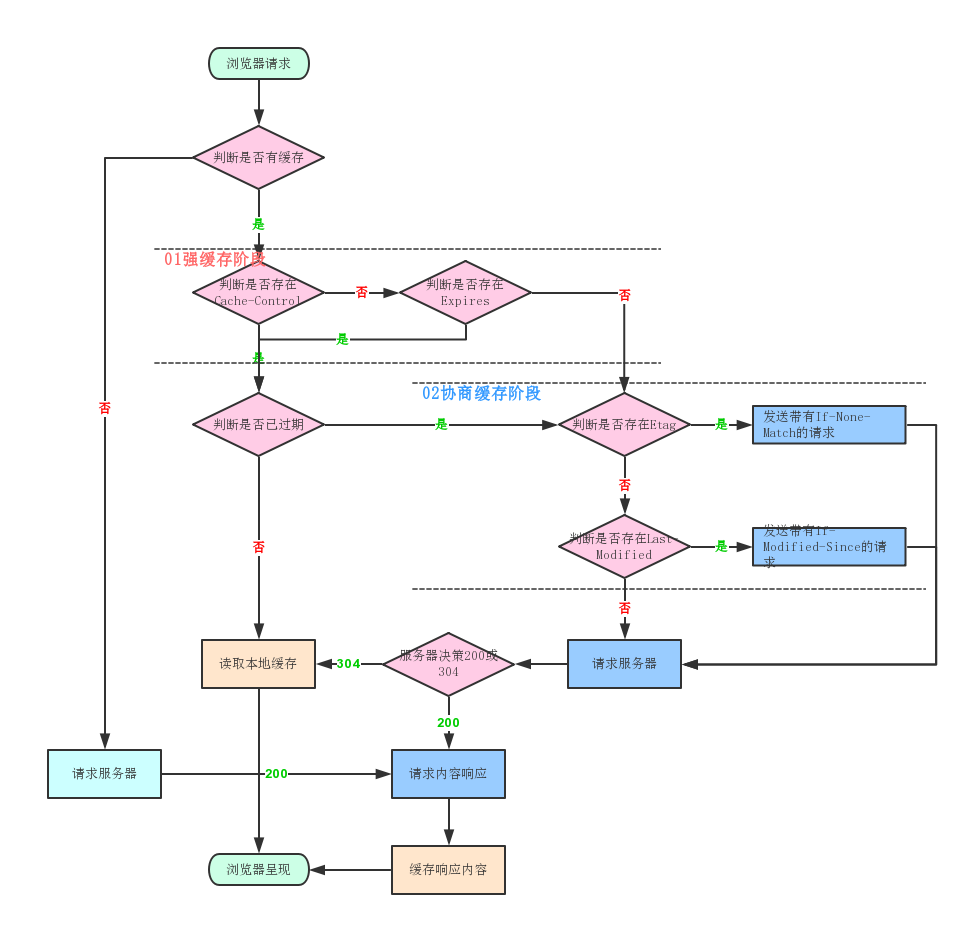

# 浏览器相关

## 浏览器存储

## 安全（CSRF、XSS）

### XSS(Cross-Site Scripting) 跨站脚本攻击

XSS 是一种代码注入攻击。攻击者可以在目标网站注入恶意脚本，使之在用户浏览器运行。利用这些恶意脚本，攻击者可以获取用户的敏感信息，如 Cookie 等

- 反射型攻击
  - 攻击者构造出特殊的 URL，其中包含恶意代码
  - 用户打开带有恶意代码的 url 时，网站服务端将恶意代码从 URL 中取出，拼接在 HTML 中返回给浏览器
  - 用户浏览器接收到响应后解析执行，混在其中的恶意代码也被执行
  - 恶意代码窃取用户数据并发送到攻击者的网站，或者冒充用户的行为，调用目标网站接口执行攻击者指定的操作
- 存储型攻击
  - 攻击者将恶意代码提交到目标网站数据库中
  - 用户打开目标网站，网站服务端将恶意代码从数据库取出，拼接在 HTML 中返回给浏览器
  - 用户浏览器接收到响应后解析执行，混在其中的恶意代码也被执行
  - 恶意代码窃取用户数据并发送至攻击者网站或服务器
- 基于 dom 的 xss 攻击
  - 攻击者构造出特殊的 URL，其中包含恶意代码
  - 用户打开带有恶意代码的 URL。
  - 户浏览器接收到响应后解析执行，前端 JavaScript 取出 URL 中的恶意代码并执行

xss 防范措施

- 输入过滤
- 预防存储型和反射型 xss 攻击
  - 改成纯前端渲染，把代码和数据分隔开
  - 对 HTML 做充分转义
- 预防 dom 的 xss 攻击
- Content Security Policy
  - 严格的 CSP 在 XSS 的防范可以起到下面几个作用
  - 禁止加载外域代码，防止复杂的攻击逻辑
  - 禁止外域提交，网站被攻击后，用户的数据不会泄露到外域
  - 禁止内联脚本执行
  - 禁止未授权的脚本执行
  - 合理使用上报可以及时发现 XSS，利于尽快修复问题
- HTTP-only Cookie
  - 禁止 js 读取某些敏感 cookie，攻击者完成 XSS 注入后也无法窃取此 Cookie

### CSRF(Cross-Site request forgery) 跨站请求伪造

攻击者诱导受害者进入第三方网站，在第三方网站中，向被攻击网站发送跨站请求。利用受害者在被攻击网站已经获取的注册凭证，绕过后台的用户验证，达到冒充用户对被攻击网站执行某项操作的目的

- get 类型的 csrf
  - get 类型的 csrf 非常简单，只需要一个 http 请求
- post 类型的 csrf
  - 这种类型的 csrf 利用起来通常私用的是一个自动提交的表单
- 链接类型的 csrf
  - 链接类型的 CSRF 并不常见，比起其他两种用户打开页面就中招的情况，这种需要用户点击链接才会触发。这种类型通常是在论坛中发布的图片中嵌入恶意链接，或者以广告的形式诱导用户中招，攻击者通常会以比较夸张的词语诱骗用户点击

csrf 防范措施

- 同源检测
  - 利用 http 请求中的 Origin Header 和 Referer Header，服务器可以通过解析这两个 header 中的域名，来确认请求的来源域
- CSRF token
  - 服务器给用户生成一个 Token，这个 Token 通过加密算法进行过加密
  - 客户端页面提交请求时，把 token 加入到请求数据或者头信息中，一起传给后端
  - 后端验证前端传来的 token 和 session 是否一致
- 给 Cookie 设置合适的 SameSite

### 其它

- 点击劫持
- HTTP 严格传输安全
- CDN 劫持
- 内容安全策略

## 缓存策略

浏览器在加载资源时，会先根据这个资源的 header 判断它是否命中缓存，强缓存如果命中，浏览器直接在自己的缓存中读取资源，不会发请求到服务器
当强缓存没有命中的时候，浏览器一定会发送一个请求到服务器，通过服务器端依据资源的另外一些 header 字段验证是否命中协商缓存，如果协商缓存命中，服务器会将这个请求返回，但是不会返回这个请求的资源数据，而是告诉客户端可以直接从缓存中加载这个资源
强缓存和协商缓存的共同点是：如果命中，都是从客户端缓存中加载资源，而不是从服务器加载资源数据；区别是：强缓存不发请求到服务器，协商缓存会发请求到服务器
当协商缓存也没命中时，浏览器直接从服务器拉取资源

### 强缓存

当浏览器对某个资源的请求命中了强缓存时，返回的 HTTP 状态码为 200，在谷歌浏览器的开发者工具的 network 里面 size 会显示 disk cache 或 memory cache

- Cache-Control 的 max-age 的优先级高于 Expires，以秒为单位，是一个相对时间
  - 第一次请求某个资源，服务器返回这个资源同时，在 response 的 header 加上了 Cache-control 的 header，浏览器接收到这个资源后，会把这个资源连同 header 缓存下
  - 浏览器再次请求这个资源，先从缓存中寻找，找到这个资源后，根据它第一次的请求时间和 Cache-control 设定的有效期，计算出一个资源过期时间，再拿这个过期时间和当前请求时间比较，如果请求时间再过期时间之前，就命中缓存
  - 属性值
    - max-age 过期时长
    - public 客户端和代理服务器都可以缓存
    - private 只有浏览器能缓存了，中间的代理服务器不能缓存
    - no-cache 跳过当前的强缓存，发送HTTP请求，即直接进入协商缓存阶段
    - no-store 非常粗暴，不进行任何形式的缓存
- Expires 是 http1.0 提出的一个表示资源过期时间的 header，值是一个绝对时间，由服务器返回
  - 缺点：由于它是服务器返回的一个绝对时间，在服务器时间和客户端时间相差较大时，缓存会出问题，还有就是客户端可以随意更改时间

### 协商缓存

强缓存失效之后，浏览器在请求头中携带相应的 缓存tag 来向服务器发请求，由服务器根据这个tag，来决定是否使用缓存，这就是协商缓存

- Last-Modified最后修改时间 Last-Modified(服务端响应携带) & If-Modified-Since (客户端请求携带) ，其优先级低于 Etag
  - 浏览器第一次跟服务器请求一个资源，服务器返回资源的同时，会在 response 的 header 加上 Last-Modified，表示资源在服务器上的最后修改时间
  - 浏览器再次请求这个资源，在 request header 上加上 If-Modified-Since 的 header，这个 header 就是上一次请求时返回的 Last-Modified
  - 服务器再次受到请求，根据浏览器传过来的 If-Modified-Since 和资源在服务器上的最后修改时间判断资源是否有变化，如果没有变化则返回 304 Not Modified
  - 缺点：有时候服务器上资源有变化，但是最后修改时间却没有变化，就会影响缓存安全性
- ETag Etag(服务端响应携带) & If-None-Match(客户端请求携带)
  - 这个唯一标识是一个字符串，只要资源有变化这个值就不同

服务端判断值是否一致，如果一致，则直接返回 304 通知浏览器使用本地缓存，如果不一致则返回新的资源

两者对比

- 精度上：Etag优于Last-Modified，Last-Modified的感知单位是秒，Etag是按照内容给资源生成的唯一标识，能准确感知资源的变化
- 性能上：Last-Modified优于Etag，Last-Modified仅仅只是记录一个时间点，而 Etag需要根据文件的具体内容生成哈希值

### 缓存位置

- Service Worker
  - 借鉴webworker思路，独立于浏览器窗口，因此无法直接访问DOM
  - 离线缓存 Service Worker 可以拦截网络请求并决定如何响应。这使得开发者可以在用户离线时提供自定义的离线页面，或者从缓存中提供之前存储的资源
  - 消息推送 即使在应用未运行的情况下，Service Worker 也可以接收来自服务器的推送消息，并显示通知给用户
  - 网络代理 Service Worker 可以拦截网络请求并根据需要修改请求和响应，这使得开发者可以实现例如请求重试、请求重定向等复杂的网络功能
- Memory Cache
  - 内存缓存，从效率上来讲它是最快的，但存活时间又是最短的 当渲染进程结束后，内存缓存也就不存在了
- Disk Cache
  - 存储在磁盘中的缓存，存取效率上来讲比内存缓存慢，但是存储容量大&存活时间久
- Push Cache
  - 推送缓存，它是HTTP/2的特性
  - 在 HTTP/2 中，服务器可以在客户端需要之前就主动将资源推送到客户端的缓存中，这样当客户端需要这些资源时就可以直接从缓存中获取，而不需要再向服务器发送请求

## 本地存储

### Cookie

http协议是一个无状态协议，客户端向服务器发送请求，服务器返回响应，如何让服务端知道客户端是谁，如何跟踪用户状态？这种背景下，产生了Cookie

Cookie本质上是一个文本文件（内部以键值对的方式来存储），保存在客户端的硬盘上，当浏览器访问服务器时，会将Cookie信息自动发送给服务器。

- 内容缺陷 体积上限只有4kb，只能用来存储少量数据
- 性能缺陷 Cookie紧跟域名，不管域名下的某一个地址需不需要这个Cookie，请求都会携带上完整的Cookie，造成性能浪费
- 安全缺陷 由于Cookie以纯文本方式在浏览器和服务器之间传递，很容易被非法用户截取，然后进行一系列篡改，这是非常危险的

### localStorage和sessionStorage

localStorage

- 容量：上限为5MB，针对同域名，对于一个域名来说是持久存储的
- 只存储在客户端，默认不参与服务端的通讯
- 接口封装，操作方便

sessionStorage

- 容量。容量上限也为 5M
- 只存在客户端，默认不参与与服务端的通信。
- sessionStorage和localStorage有一个本质的区别，那就是前者只是会话级别的存储，并不是持久化存储。会话结束，也就是页面关闭，这部分sessionStorage就不复存在了

### IndexedDB

IndexedDB 是 HTML5 中新增的数据库，它允许在浏览器端存储大量结构化数据。

- 键值对存储 使用键值对来存储数据，每个键值对被存储在一个对象存储空间
- 异步操作 不会阻塞浏览器主线程
- 大数据存储
- 支持事务 意味着你可以在一个操作失败时回滚其它操作，保证数据一致性
- 二进制数据存储 支持存储二进制数据，如 Blob 对象或 TypedArray 对象
- 受同源策略限制

## 从输入URL到页面呈现发生了什么 (网络)

网络请求

- 构建请求：浏览器会构建请求行
- 查找强缓存：先检查强缓存，如果命中直接使用，否则进入下一步
- DNS解析
  - 由于我们输入的是域名，而数据包是通过IP地址传给对方的，因此我们需要知道域名对应的IP地址,这个过程需要依赖一个服务系统，这个系统将域名和IP一一映射，也就是所称的DNS(域名系统)
  - 如果浏览器或操作系统缓存了这个域名的解析结果，就直接使用这个结果，否则向DNS服务器发送请求解析域名
  - 如果不指定端口的话，默认采用对应的80端口
- 建立TCP连接 (Transmission Control Protocol，传输控制协议)
  - 通过三次握手(即总共发送3个数据包确认已经建立连接)建立客户端和服务器之间的连接
  - 进行数据传输：这里有一个重要机制，接收方接收到数据包后必须要向发送方确认，如果发送方没有收到这个确认消息，就判定为数据包失败，并重新发送该数据包。优化策略：大数据包拆成一个个小包，依次传输到接收方，接收方按照小包顺序组装成完整的数据包
  - 断开连接阶段：数据传输完成，通过4次挥手来断开连接
- 发送HTTP请求
  - TCP连接建立完毕，浏览器可以和服务器通信，即开始发送HTTP请求，浏览器发送HTTP请求要携带3样东西：请求行、请求头、请求体

网络响应

HTTP 请求到达服务器，服务器进行对应的处理。最后要把数据传给浏览器，也就是返回网络响应；跟请求部分类似，网络响应具有三个部分:响应行、响应头和响应体

## 从输入URL到页面呈现发生了什么 (渲染)

## DNS解析过程
