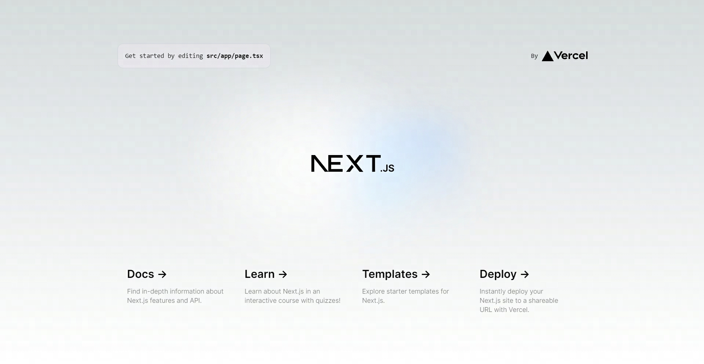

# [Next.js 14] 基于Next.js的前端工程创建和模板化

next.js 是一个基于React的轻量化服务端渲染框架，它提供了一些开箱即用的特性，如基于文件系统的路由器、自动代码分割、静态文件服务、CSS模块化、服务端渲染、热模块替换等，使得开发者可以快速高效构建React应用程序

特点

- 基于文件系统的路由器 不需要配置路由器
- 服务端渲染 Next.js 可以在服务器端渲染 React 组件，从而提高页面的加载速度和 SEO
- 自动代码分割 Next.js 可以自动将页面和组件拆分成小块，从而提高页面的加载速度
- 静态文件服务
- CSS模块化 Next.js 支持css模块化，可以将css样式和组件进行关联，从而避免央视冲突
- 热模块替换 Next.js 支持热模块替换，可以在不刷新页面的情况下更新组件

## 项目创建

Next.js 14 对Node.js版本要求 18.17 以上

```shell
# 自动安装
npx create-next-app@latest
# 已创建项目手动安装
npm install next@latest react@latest react-dom@latest
```

使用TypeScript模板来创建一个默认的Next.js 应用

```shell
npx create-next-app@latest
What is your project named? ... next-project
Would you like to use TypeScript? ... No / Yes
Would you like to use ESLint? ... No / Yes
Would you like to use Tailwind CSS? ... No / Yes
Would you like to use `src/` directory? ... No / Yes
Would you like to use App Router? (recommended) ... No / Yes
Would you like to customize the default import alias (@/*)? ... No / Yes
What import alias would you like configured? ... @/*
Creating a new Next.js app in D:\study\react\next-project.
```

- TypeScript YES
- ESLint YES
- use `src/` directory 默认是app路径，前端一般较多使用src目录，这个选NO 会生成src/app路径
- App Router 是否使用 APP 路由模式
- 是否使用 @ 设置别名

命令执行完成后，运行项目

```shell
npm run dev
```

打开 <http://localhost:3000/> 看到这个项目已经成功运行



## 代码格式化和质量工具

代码规范推荐使用创建项目时的eslint支持

```shell
# 这个选项选YES,自动生成eslint配置和安装对应的依赖包
Would you like to use ESLint? ... No / Yes 
```

自动格式化我们安装prettier插件实现

```shell
npm install prettier --save-dev
```

根目录添加两个文件，.prettierrc和.prettierignore

.prettierrc 项目的prettier配置（配置什么完全取决于自己团队或自己的代码风格）

```json
{
  "trailingComma": "es5",
  "tabWidth": 2,
  "semi": true,
  "singleQuote": true
}
```

.prettierignore 忽略代码格式化的文件或文件夹

```text
.yarn
.next
dist
node_modules
```

自动化prettier，在package.json中新增script脚本

```json
{
  "scripts: {
    ...
    "prettier": "prettier --write ."
  }
}
```

以上配置好之后可以试着执行

```shell
npm run prettier
```

看下自己配置的格式化有没有生效

## vscode配置

根目录下新增 .vscode 文件夹，创建settings.json文件，该文件是一个覆盖已安装vscode的默认设置值，该文件配置仅对当前项目生效

具体配置说明可以点左下角设置按钮，找到设置菜单，打开后可以查看自己vscode的各项设置

```json
{
  "editor.defaultFormatter": "esbenp.prettier-vscode",
  "editor.formatOnSave": true,
  "editor.codeActionsOnSave": {
    "source.fixAll": "explicit",
    "source.organizeImports": "explicit"
  },
  "editor.tabSize": 2
}
```

## 调试

在 .vscode 目录下创建 launch.json 文件

```json
{
  "version": "0.1.0",
  "configurations": [
    {
      "name": "Next.js: debug server-side",
      "type": "node-terminal",
      "request": "launch",
      "command": "npm run dev"
    },
    {
      "name": "Next.js: debug client-side",
      "type": "chrome",
      "request": "launch",
      "url": "<http://localhost:3000>"
    },
    {
      "name": "Next.js: debug full stack",
      "type": "node-terminal",
      "request": "launch",
      "command": "npm run dev",
      "serverReadyAction": {
        "pattern": "started server on .+, url: (https?://.+)",
        "uriFormat": "%s",
        "action": "debugWithChrome"
      }
    }
  ]
}

```

## Next.js的目录结构

在初始化next14版本的项目时，会有个选项询问是否喜欢src目录结构，nextjs默认是不会生成src目录结构的，因此如果喜欢src风格的目录结构，这个选项要注意一下

```shell
# 是否生成src的目录结构
Would you like to use `src/` directory? ... No / Yes
```

我默认生成的是src风格的目录

```md
/app 默认生成的app路径
/app/pages 路由页面
/utils 工具类脚本
/components 组成应用程序的各个 UI 组件将位于此处
```

## 创建组件或页面模板

依赖包 fs-extra mustache log-symbols inquirer 等依赖

- fs-extra 是 fs 的扩展，继承了 fs 所有方法并为这些方法添加了 promise 语法
- mustache 是一种无逻辑的模板语法。它可用于 HTML、配置文件、源代码 - 任何东西
- log-symbols 各种日志级别的彩色符号
- inquirer Node.js的一个易于嵌入且美观的命令行界面

注意：如果出现 Error [ERR_REQUIRE_ESM]: require() of ES Module not supported 说明是某个包不支持require，就需要看对应的包哪个版本支持require，我这边碰到两个包最新版本不支持require，因此我选择了低版本（inquirer@7.1.0, log-symbols@4.0.0）

```shell
npm i fs-extra mustache log-symbols inquirer --save-dev
```

根目录创建bin文件夹，存放创建模板等脚本

bin文件夹下创建new/index.js 用于生成模板文件

```js
const rimraf = require('rimraf');
const inquirer = require('inquirer');
const fs = require('fs-extra');
const path = require('path');
const Mustache = require('mustache');

const createModuleFiles = (moduleName, moduleType, moduleDesc) => {
  const outputName =
    moduleName[0].toLowerCase() + moduleName.slice(1, moduleName.length);
  const templates = [
    {
      template: 'moduleComponentTsx.tpl',
      output: `app/components/${moduleName}/${moduleName}.tsx`,
    },
    {
      template: 'moduleComponentStyle.tpl',
      output: `app/components/${moduleName}/${moduleName}.module.css`,
    },
  ];
  try {
    let tpl, output;
    templates.forEach((temp) => {
      tpl = fs.readFileSync(
        path.resolve(__dirname, `./templates/component/${temp.template}`),
        'utf8'
      );
      output = Mustache.render(tpl, { moduleName, outputName, moduleDesc });
      fs.outputFileSync(path.resolve(process.cwd(), temp.output), output);
    });
    console.log('模块文件创建完成');
  } catch (error) {
    console.error(error);
  }
};

class NewModule {
  constructor() {
    this.createModule();
  }

  async createModule() {
    // 模块类型
    const moduleType = await this.inputType();
    // 模块名
    const moduleName = await this.inputName();
    // 模块描述
    const moduleDesc = await this.inputDesc();
    // 清除重名文件
    await this.clearFile(moduleName, moduleType);
    createModuleFiles(moduleName, moduleType, moduleDesc);
  }

  async inputType() {
    const { moduleType } = await inquirer.prompt([
      {
        name: 'moduleType',
        message: '请选择创建类型',
        type: 'list',
        choices: [
          {
            name: 'UI组件',
            value: 'component',
          },
          {
            name: '页面',
            value: 'page',
          },
        ],
        default: 'component',
      },
    ]);
    return moduleType;
  }
  async inputName() {
    const { moduleName } = await inquirer.prompt([
      {
        name: 'moduleName',
        message: '请输入模块名称',
        type: 'input',
      },
    ]);
    return moduleName;
  }
  async inputDesc() {
    const { moduleDesc } = await inquirer.prompt([
      {
        name: 'moduleDesc',
        message: '请输入模块描述',
        type: 'input',
      },
    ]);
    return moduleDesc;
  }

  async clearFile(moduleName, moduleType) {
    if (moduleType === 'page') {
      rimraf.rimraf(
        path.resolve(process.cwd(), 'app/component', `${moduleName}.module.css`)
      );
      rimraf.rimraf(
        path.resolve(process.cwd(), 'app/app', `${moduleName}.tsx`)
      );
    } else if (moduleType === 'component') {
    }
  }
}

new NewModule();

```

new文件夹下创建templates目录，用于存放模板文件，创建moduleComponentTsx.tpl文件，存放下面代码 双花括号里的都是变量，通过传参读取对应的值

```text
// {{moduleDesc}}
import styles from './{{outputName}}.module.css';

export interface I{{outputName}} {
  sampleTextProp: string;
}

const {{outputName}}: React.FC<I{{outputName}}> = ({sampleTextProp}) => {
  return (
    <div className={styles.{{outputName}}}>
      { sampleTextProp }
    </div>
  )
}

export default {{outputName}};

```

pages的逻辑类似，模板自己重新定义

在package.json 创建对应的创建脚本

```shell
{
  "scripts: {
    ...
    "create": "node bin/new"
  }
}
```

运行命令

```shell
npm run create
```

可以到自己设置的目录查看是否创建成功

效果


## 其他

[代码仓库](https://github.com/yangbo568969859/next-app)
