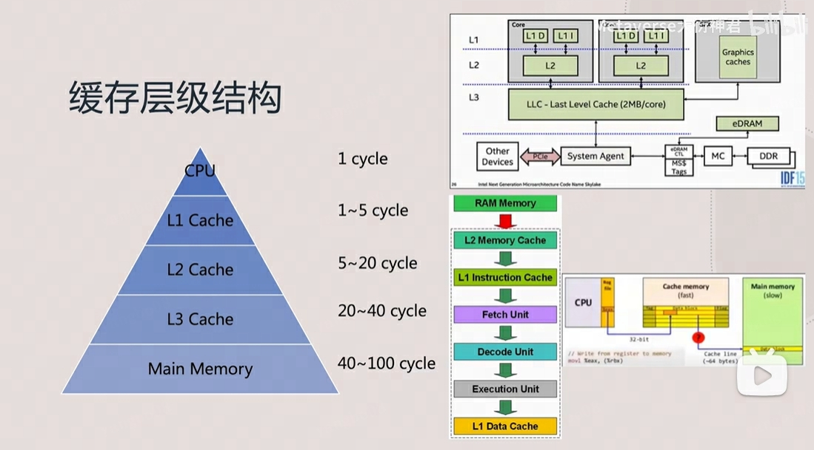
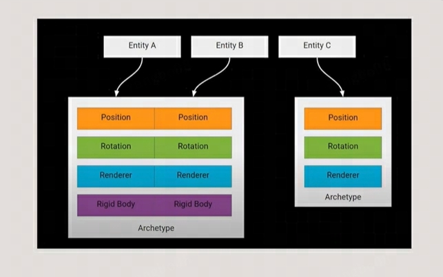
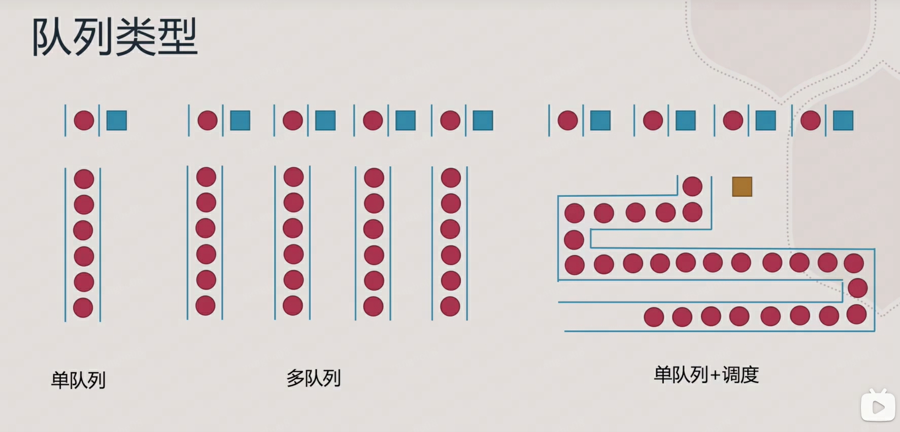

# DOTS

## DOTS是什么

Data-Oriented Technology Stack(面向数据的技术栈)

核心包

- The C# job system
- The Burst compiler
- Unity Mathematics
- Unity Collections
- Entities (Entity-Component System)

其它相关包

- Entities.Graphics(Hybrid Renderer)
- Netcode
- Physics
- Animation
- Audio

## DOTS用在哪里

- 具有大世界流式加载的游戏
- 具有复杂的大规模模拟的游戏
- 具有多种网络类型的多人连线游戏
- 具有需要客户端模拟预测的网络游戏，如FPS

### DOTS面向数据设计原则

- 先设计，后编码
- 为高效使用内存与缓存而设计
- 为Blittable Data设计
- 为普通情况设计
- 拥抱迭代

### 程序设计方法

- Instructional Programming 指令化编程
- Functional Programming 函数化编程
- Procedural Programming 过程化编程
- Object-Oriented Programming/Design 面向对象编程/设计(OOP/OOD)
- Data-Oriented Design(DOD) 面向数据设计

#### 现代CPU缓存层级结构

关于缓存的3C和3R

- Compulsory misses 首次读取数据时，不可避免的MISS
- Capacity misses 缓存空间不足时，连续使用期间访问数据过多的话，无法保存所有活动的数据
- Conflict misses 发生访问冲突时，由于数据映射到相同的缓存行，导致缓存的抖动
- Rearrange 重新排列（代码，数据）： 更改数据的布局以增加数据空间的局部性
- Reduce 减少（大小，缓存行读取）： 更小更智能的格式/压缩
- Reuse 重用（Cache lines）： 增加数据的时间（和空间）的局部性

### ECS架构 (Entity-Component-System)

实体组件系统（ESC）架构

- 遵循组合优先继承的原则
- 面向数据设计
- 弱耦合
- 常被应用在游戏开发上

游戏引擎架构演变

- 基于对象继承的架构

- 基于Actor-component对象组合架构

- 基于ECS的面向数据设计架构

### DOTS下关于ECS的专有名词

- Archetypes 原型 Archetype依然不是个对象,是个标识符,标识的是所有具有相同的Component组合的实体类型
- Chunk 而每个Archetype原型所标记的内存会被分成固定大小连续的非托管内存块，被称为Archetype Chunk，chunk种会包含共享同一原型的实体组件数组，默认设置下每个chunk大小为16k,如果实体组件数组填充不满的话，也要有留白,Chunk存在的目的是为了方便数据做并行计算,方便做缓存的prefetch(是面向缓存友好的重要概念)
- World 一系列entity的组合，每一个entity在一个world中是唯一的，统一受到world中的EntityManager管理
- EntityManager 负责创建，修改，销毁world中的实体
- Structural Change 所有导致需要重新组织内存块或内存块内容的操作，都成为Structural Change（结构和内容）
- Baking
  - SubScene
  - Baker
  - Authoring component
  - Baking ststem
- Query
  - Share component filter
  - Version filtering
- QueryBuilder
  - SystemAPI.Query
- ISystem
- BlobAssets
- Entites.Foreach
- Prefab entity(a.k.a Entity prefab)
- Lookup

### DOTS下的ECS

- Entity: Entity不是一个容器，它只是一个标识符，它用来指示某个对象的存在。系统可以用它来操作，可以通过组件来分配某些属性
- Component: 组件是一个数据容器，没有任何逻辑，一组特定的参数关联在一起并定义属性
- System: 系统是负责对数据进行操作的部分。换句话说，系统是对具有特定属性（组件）的特定实体执行的操作

### 如何理解L1,L2,L3级缓存这种树形结构设计

#### CACHE层级与排队管理

队列类型

